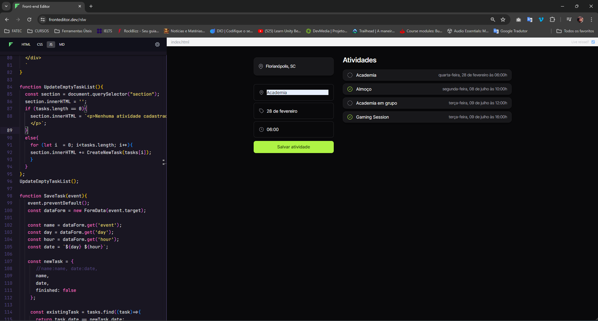
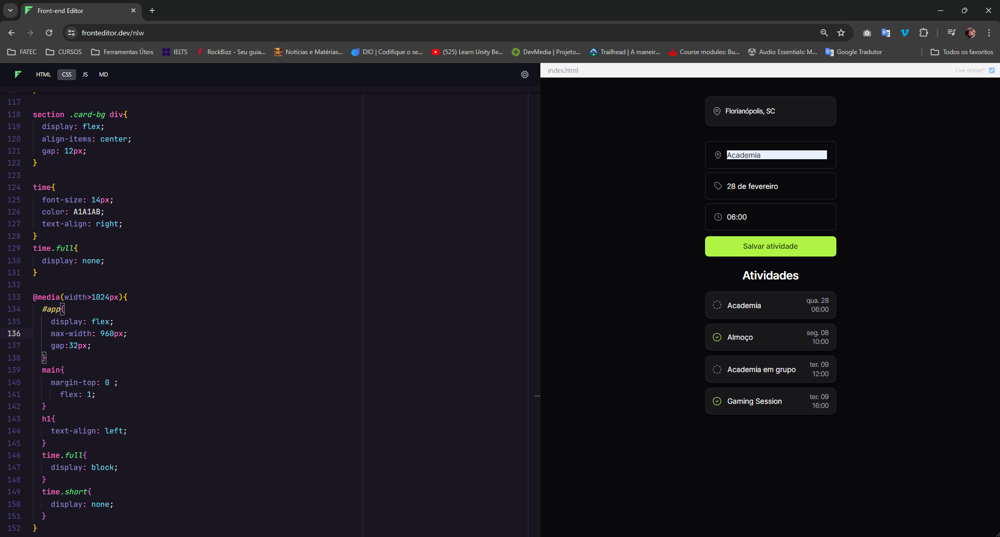

# NLW Journey|

### Este projeto foi feito em um dos eventos da rocketseat. Um evento para desenvolvedores de programação que querem aprimorar ou começar sua carreira dev.
#### - Aqui está o projeto: https://www.figma.com/community/file/1392277205162897872

## Tecnologias Utilizadas

 <a href="https://www.w3.org/html/" target="_blank" rel="noreferrer">  

## Projeto

O projeto é para montar um roteiro de viagem, cadastrando atividades. onde voce pode adicionar suas atividades a serem compridas, definir dia e horario.

 

